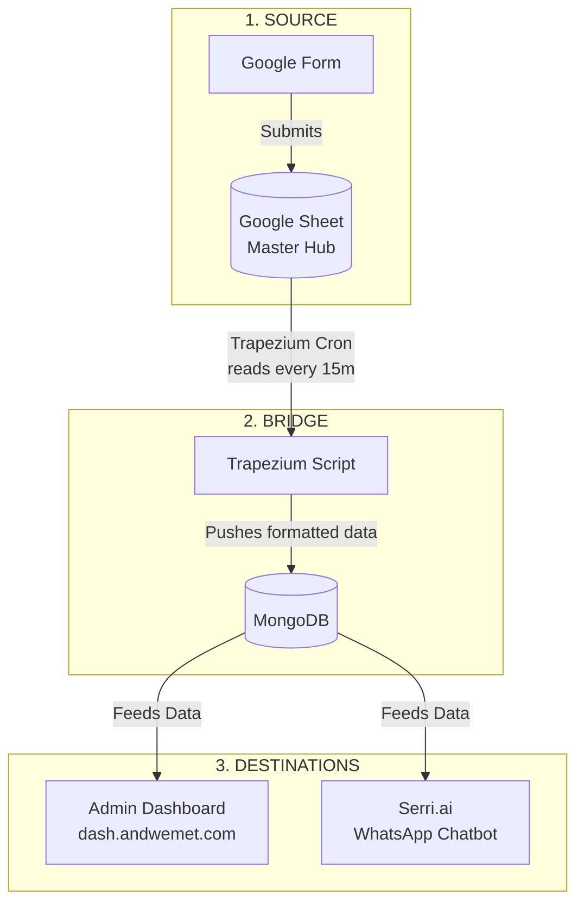
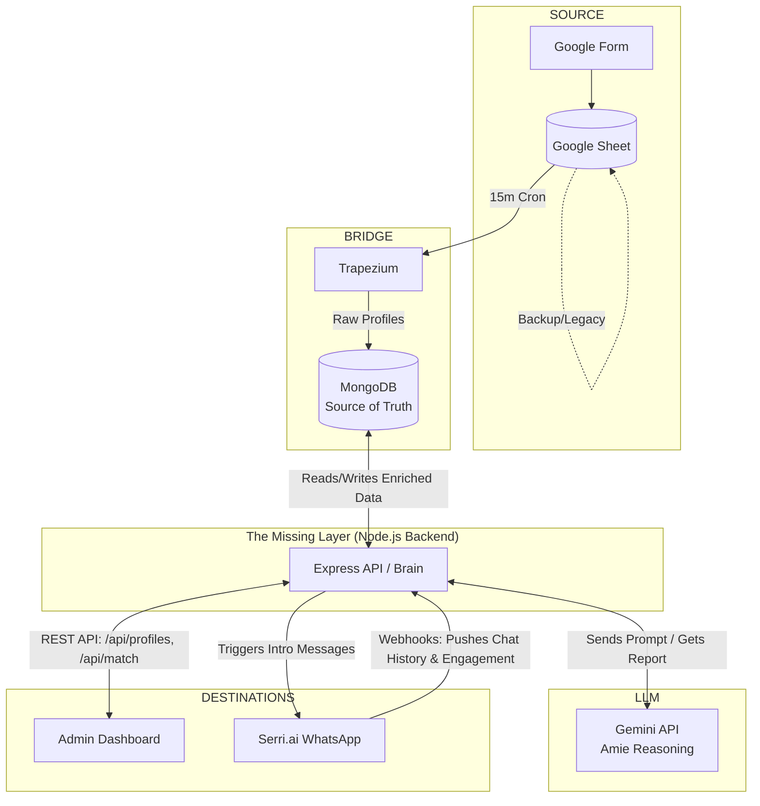

# AndWeMet: Enterprise Architecture & Strategy Plan

This document outlines the current data flow, the architectural bottlenecks preventing the "Amie" AI Matchmaker from scaling, and the strategic blueprint for the production system.

---

## 1. The Current Architecture

Based on the existing infrastructure, the data flows in a unidirectional pipeline:

### 🚨 Problems with the Current Setup

1. **The Serri Data Trap (One-Way Street)**
   * **Problem:** MongoDB feeds Serri who to talk to, but Serri is a closed ecosystem. When a user chats with the bot or engages with community questions on WhatsApp, that rich qualitative data stays trapped in Serri. 
   * **Impact:** The Dashboard cannot see real-time engagement, and the AI Matchmaker cannot use chat history to understand user psychology.

2. **The Dashboard is Read-Only**
   * **Problem:** The dashboard pulls data directly from MongoDB to display profiles, but it has no operational power. You cannot safely click "Run Match" or "Approve Intro" from the client side without exposing database credentials or complex API keys.
   * **Impact:** Admin operations remain manual.

3. **No Brain for "Amie"**
   * **Problem:** Serri's built-in AI (Dialogflow) is intent-based, designed for customer support (e.g., "track my order"). It cannot ingest two massive psychological profiles + chat histories and output a nuanced compatibility report.
   * **Impact:** The core value proposition—deep psychological matchmaking—requires an external LLM (like Gemini 2.5 Flash or GPT-4o), but there is no server currently orchestrating this.

---

## 2. The Solution: The "Middleware Brain"

To solve these problems, we introduce a **Node.js/TypeScript Backend**. This acts as the central traffic controller, turning the unidirectional pipeline into a closed-loop system.

### The Target Architecture

### 💡 Solutions of the New Architecture

1. **Closing the Loop (Two-Way Serri Sync)**
   * **Solution:** Configure Serri Webhooks. Every time a user replies on WhatsApp, Serri pings the new Node.js backend. The backend saves the `chat_log` and updates the `engagement_score` in MongoDB.
   * **Result:** The dashboard instantly shows exactly how active a user is, and Amie can read their actual conversation history, not just their static form answers.

2. **The Dashboard Becomes a Command Center**
   * **Solution:** Instead of the dashboard reading MongoDB directly, it talks to the Node.js backend securely via REST APIs (e.g., `GET /api/users`). 
   * **Result:** When you click "Soft Delete", the backend updates the DB. When you click "Run AI Match", the backend orchestrates the heavy lifting securely.

3. **Orchestrating Amie (The External LLM)**
   * **Solution:** The Node.js backend contains the Amie logic. When triggered by the dashboard, the backend:
     1. Fetches User A and User B from MongoDB.
     2. Fetches their recent Serri chat logs from MongoDB.
     3. Constructs a massive prompt.
     4. Calls the **Gemini API** (massive context window, extremely cheap).
     5. Saves the resulting report to a `matches` collection in MongoDB.

---

## 3. Strategic Roadmap & Implementation Strategy

We will build this in 4 distinct phases to ensure stability without taking the current system offline.

### Phase 1: Foundation (The Backend Shell)
*Current Status: Initialising `server/src/index.ts`*
- Set up a standard Express.js + Node + TypeScript backend.
- Connect the backend securely to the existing MongoDB cluster using Mongoose.
- Build standard CRUD endpoints (`GET /api/users`, `PUT /api/users/:id`).
- **Goal:** Get the backend running locally and talking to the database.

### Phase 2: Connecting the Dashboard
- Update the React Vite app (Dashboard) to fetch data from the new backend API instead of using mock data or direct DB connections.
- Implement the "Write" features securely via the backend (Soft Delete user, Update Admin Notes, Change Pipeline Status).
- **Goal:** The dashboard is now a fully functional, read/write CRM powered by the backend.

### Phase 3: The LLM Engine (Amie)
- Implement the `lib/matchmaker.ts` logic inside the backend.
- Integrate the official Google Gemini SDK.
- Create the `POST /api/match` endpoint. The dashboard calls this, the backend processes the LLM request, stores the result in MongoDB, and returns it to the dashboard.
- **Goal:** Live, real-time AI matchmaking driven from the dashboard UI.

### Phase 4: The Serri Webhook Loop
- Create an endpoint in the Node backend `POST /api/webhooks/serri`.
- Register this URL inside the Serri.ai platform.
- When a user chats, Serri hits this endpoint. The backend processes the message and updates user engagement stats and chat logs in MongoDB.
- Build the `POST /api/intro` endpoint so the dashboard can tell Serri to send a WhatsApp message when a match is approved.
- **Goal:** Fully automated, data-rich engagement loop.

---

## 4. Core Technologies to Use

| Layer | Technology | Why |
|-------|------------|-----|
| **Database** | MongoDB | Highly flexible document store. Already in use. |
| **Backend** | Express + Node.js (TypeScript) | Fast, async, huge ecosystem. Perfect for handling webhooks and passing JSON to React. |
| **Frontend** | React + Vite | Blazing fast to construct the CRM. Already prototyped. |
| **LLM / AI** | Gemini 2.5 Flash | 1M+ token context window. Essential for stuffing massive conversation histories into the prompt for reasoning. |
| **Communications**| Serri.ai API | Best-in-class WhatsApp automation wrapper. |

## 5. Security & Stability Policies

- **Google Sheet Sanctity:** Never write to the Google Sheet from the backend. It remains the pristine, raw ingestion source.
- **Data Hydration:** If a user modifies their profile on WhatsApp via Serri, the backend applies the update to MongoDB, making MongoDB the ultimate Source of Truth.
- **Human In The Loop:** The backend will *never* trigger a WhatsApp introduction message autonomously based merely on an Amie high score. The process is always: `Amie Suggests ➔ Admin Approves ➔ Backend Sends`.
